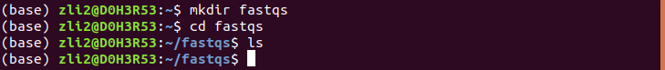

[Back to curriculum](README.md)

# 0. The Basics
## The Mighty CMD
The command line interface is your friend, not your enemy. Even though it may feel unnatural and awkward to use at first, once you get use to it, you will be amazed at the versatility and power.  
  
### The most basic commands:
**mkdir**: make a new directory ("folder");  
**cd**: navigate between directories;  
**ls**: list contents of a directory;  
  
Let's give these a try:

```
mkdir fastqs
cd fastqs
ls
```

## Version control
The concept of version control is really crucial when it comes to anything related to computer science and bioinformatics. Softwares, scripts and datasets will mount to an unfathomable mass, and if there is no efficient and effective record-keeping, then the whoe system is destined for failure. Therefore, it is important to develop an instinct for version controlling and record keeping as soon as possible.  
Some of the version controling is done automatically with the right tools and the right setup (conda e.g.). Others require a bit more attention, like using git to control the versions of various scripts. We will touch on the specific programs in later sections.  

[Next >>](1-data-script-and-environment-management.md)  
