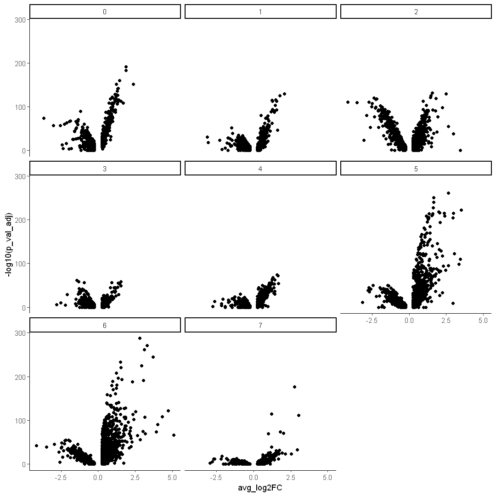

# CNR Bioinformatics Workshop

[Back to curriculum](README.md)

# 3. Secondary Analysis
We are going to analyze aligned scRNAseq data in R, the most popular language for this type of work at the moment.

## 3.1 Install R libraries with Miniconda
First, let's install some packages with ```conda```. Fire up the cmd.
```
conda activate myEnv
conda install -c conda-forge r-base
conda install -c conda-forge r-seurat
conda install -c conda-forge r-ggplot2
conda install -c conda-forge r-dplyr
```

## 3.2 Import R libraries, set working directory and data
```R
library(Seurat)
```

    Attaching SeuratObject
    
    Attaching sp
    
    

## 3.3 Load data


```R
df <- Read10X("./outs/filtered_feature_bc_matrix/")
```


```R
df0 <- CreateSeuratObject(counts = df,
                         assay = "RNA",
                         project = "hCO",
                         min.cells = 10,
                         min.features = 200)
```

    Warning message:
    "Feature names cannot have underscores ('_'), replacing with dashes ('-')"
    


```R
df0
```


    An object of class Seurat 
    16527 features across 2342 samples within 1 assay 
    Active assay: RNA (16527 features, 0 variable features)


```R
df0$percent.mt <- PercentageFeatureSet(df0, pattern = "^MT-")
```


```R
options(repr.plot.width = 10, repr.plot.height = 5)
VlnPlot(df0,
       log = T,
       pt.size = 0,
       features = c("nFeature_RNA", "nCount_RNA", "percent.mt"))
```


    

    


#### Keep cells with more than 1000 UMI and less than 10% of reads mapped to mitochondrial genome


```R
df0 <- df0[ , df0$nCount_RNA > 1000 & df0$percent.mt < 10]
```


```R
df0
```


    An object of class Seurat 
    16527 features across 2125 samples within 1 assay 
    Active assay: RNA (16527 features, 0 variable features)


#### Remove mitochondrial genes


```R
MTs <- grep("^MT-", rownames(df0), value = T)
```

```R
df0 <- df0[!(rownames(df0) %in% MTs)]
```


```R
df0
```


    An object of class Seurat 
    16514 features across 2125 samples within 1 assay 
    Active assay: RNA (16514 features, 0 variable features)


## 3.4 Normalization between different read depth (total UMI counts) by cell


```R
df0 <- NormalizeData(df0, normalization.method = "LogNormalize", scale.factor = 10000)
```

## 3.5 Find highly variable genes


```R
df0 <- FindVariableFeatures(df0, selection.method = "vst", nfeatures = 2000)
```


```R
hvg <- VariableFeatures(df0)
```


```R
top50 <- head(VariableFeatures(df0), 50)
```


```R
options(repr.plot.width = 10, repr.plot.height = 4)
plot1 <- VariableFeaturePlot( df0, log = T )
plot2 <- LabelPoints(plot = plot1, points = top50, repel = TRUE)
plot1 + NoLegend() + plot2 + NoLegend()
```

    When using repel, set xnudge and ynudge to 0 for optimal results
    
    Warning message:
    "ggrepel: 29 unlabeled data points (too many overlaps). Consider increasing max.overlaps"
    


    

    


## 3.6 Scaling data


```R
df0 <- ScaleData(df0, features = hvg)
```

    Centering and scaling data matrix
    
    

## 3.7 Perform principal component analysis


```R
df0 <- RunPCA(df0, npcs = 50, features = hvg, verbose = F)
```


```R
options(repr.plot.width = 5, repr.plot.height = 5)
ElbowPlot(df0, ndims = 50)
```


    

    


## 3.8 2D representation with UMAP


```R
df0 <- RunUMAP(df0, dims = 1:30)
```

    Warning message:
    "The default method for RunUMAP has changed from calling Python UMAP via reticulate to the R-native UWOT using the cosine metric
    To use Python UMAP via reticulate, set umap.method to 'umap-learn' and metric to 'correlation'
    This message will be shown once per session"
    11:03:49 UMAP embedding parameters a = 0.9922 b = 1.112
    
    11:03:49 Read 2125 rows and found 30 numeric columns
    
    11:03:49 Using Annoy for neighbor search, n_neighbors = 30
    
    11:03:49 Building Annoy index with metric = cosine, n_trees = 50
    
    0%   10   20   30   40   50   60   70   80   90   100%
    
    [----|----|----|----|----|----|----|----|----|----|
    
    *
    *
    *
    *
    *
    *
    *
    *
    *
    *
    *
    *
    *
    *
    *
    *
    *
    *
    *
    *
    *
    *
    *
    *
    *
    *
    *
    *
    *
    *
    *
    *
    *
    *
    *
    *
    *
    *
    *
    *
    *
    *
    *
    *
    *
    *
    *
    *
    *
    *
    |
    
    11:03:49 Writing NN index file to temp file C:\Users\ZLI2\AppData\Local\Temp\3\RtmpALR9le\file290435047be8
    
    11:03:49 Searching Annoy index using 1 thread, search_k = 3000
    
    11:03:49 Annoy recall = 100%
    
    11:03:50 Commencing smooth kNN distance calibration using 1 thread
    
    11:03:50 Initializing from normalized Laplacian + noise
    
    11:03:50 Commencing optimization for 500 epochs, with 82866 positive edges
    
    11:03:58 Optimization finished
    
    


```R
options(repr.plot.width = 10, repr.plot.height = 10)
DimPlot(df0, pt.size = 1,reduction = "umap")
```


    

    


```R
df0 <- FindNeighbors(df0, reduction = "umap", dims = 1:2)
```

    Computing nearest neighbor graph
    
    Computing SNN
    
    


```R
df0 <- FindClusters(df0)
```

    Modularity Optimizer version 1.3.0 by Ludo Waltman and Nees Jan van Eck
    
    Number of nodes: 2125
    Number of edges: 44905
    
    Running Louvain algorithm...
    Maximum modularity in 10 random starts: 0.9030
    Number of communities: 20
    Elapsed time: 0 seconds
    


```R
options(repr.plot.width = 10, repr.plot.height = 10)
DimPlot(df0, label = T, group.by = "seurat_clusters", reduction = "umap")
```


    

    


#### Adjust resolution to get more or fewer clusters


```R
df0 <- FindClusters(df0, resolution = 0.1)
```

    Modularity Optimizer version 1.3.0 by Ludo Waltman and Nees Jan van Eck
    
    Number of nodes: 2125
    Number of edges: 44905
    
    Running Louvain algorithm...
    Maximum modularity in 10 random starts: 0.9652
    Number of communities: 8
    Elapsed time: 0 seconds
    


```R
DimPlot(df0, label = T, group.by = "seurat_clusters", reduction = "umap")
```


    

    


## 3.9 Differential gene expression analysis


```R
DEX <- FindAllMarkers(df0, only.pos = T)
```

    Calculating cluster 0
    
    For a more efficient implementation of the Wilcoxon Rank Sum Test,
    (default method for FindMarkers) please install the limma package
    --------------------------------------------
    install.packages('BiocManager')
    BiocManager::install('limma')
    --------------------------------------------
    After installation of limma, Seurat will automatically use the more 
    efficient implementation (no further action necessary).
    This message will be shown once per session
    
    Calculating cluster 1
    
    Calculating cluster 2
    
    Calculating cluster 3
    
    Calculating cluster 4
    
    Calculating cluster 5
    
    Calculating cluster 6
    
    Calculating cluster 7
    
    


```R
DEX
```


<table class="dataframe">
<caption>A data.frame: 7124 × 7</caption>
<thead>
	<tr><th></th><th scope=col>p_val</th><th scope=col>avg_log2FC</th><th scope=col>pct.1</th><th scope=col>pct.2</th><th scope=col>p_val_adj</th><th scope=col>cluster</th><th scope=col>gene</th></tr>
	<tr><th></th><th scope=col>&lt;dbl&gt;</th><th scope=col>&lt;dbl&gt;</th><th scope=col>&lt;dbl&gt;</th><th scope=col>&lt;dbl&gt;</th><th scope=col>&lt;dbl&gt;</th><th scope=col>&lt;fct&gt;</th><th scope=col>&lt;chr&gt;</th></tr>
</thead>
<tbody>
	<tr><th scope=row>THSD7A</th><td>6.045978e-196</td><td>1.8697358</td><td>0.936</td><td>0.344</td><td>9.984329e-192</td><td>0</td><td>THSD7A   </td></tr>
	<tr><th scope=row>CDH7</th><td>8.096795e-188</td><td>1.8878890</td><td>0.677</td><td>0.088</td><td>1.337105e-183</td><td>0</td><td>CDH7     </td></tr>
	<tr><th scope=row>CADM1</th><td>9.910354e-165</td><td>1.4515527</td><td>0.961</td><td>0.594</td><td>1.636596e-160</td><td>0</td><td>CADM1    </td></tr>
	<tr><th scope=row>NTS</th><td>1.028108e-156</td><td>2.3811702</td><td>0.753</td><td>0.192</td><td>1.697817e-152</td><td>0</td><td>NTS      </td></tr>
	<tr><th scope=row>LINC00643</th><td>6.132768e-156</td><td>1.2198939</td><td>0.821</td><td>0.219</td><td>1.012765e-151</td><td>0</td><td>LINC00643</td></tr>
	<tr><th scope=row>CNTNAP2</th><td>1.002729e-146</td><td>1.3381175</td><td>0.975</td><td>0.578</td><td>1.655906e-142</td><td>0</td><td>CNTNAP2  </td></tr>
	<tr><th scope=row>NEUROD6</th><td>1.564023e-145</td><td>1.3210439</td><td>0.994</td><td>0.573</td><td>2.582828e-141</td><td>0</td><td>NEUROD6  </td></tr>
	<tr><th scope=row>BCL11B</th><td>5.386061e-141</td><td>1.2989753</td><td>0.950</td><td>0.489</td><td>8.894541e-137</td><td>0</td><td>BCL11B   </td></tr>
	<tr><th scope=row>GABRG2</th><td>1.876424e-133</td><td>1.1450737</td><td>0.776</td><td>0.231</td><td>3.098726e-129</td><td>0</td><td>GABRG2   </td></tr>
	<tr><th scope=row>KAZN</th><td>2.155009e-132</td><td>1.2500493</td><td>0.857</td><td>0.385</td><td>3.558781e-128</td><td>0</td><td>KAZN     </td></tr>
	<tr><th scope=row>GPR22</th><td>3.700312e-131</td><td>1.3231371</td><td>0.771</td><td>0.219</td><td>6.110695e-127</td><td>0</td><td>GPR22    </td></tr>
	<tr><th scope=row>GABRB3</th><td>1.038149e-130</td><td>1.2282807</td><td>0.868</td><td>0.399</td><td>1.714400e-126</td><td>0</td><td>GABRB3   </td></tr>
	<tr><th scope=row>DOK6</th><td>2.392019e-129</td><td>1.1933333</td><td>0.830</td><td>0.320</td><td>3.950180e-125</td><td>0</td><td>DOK6     </td></tr>
	<tr><th scope=row>OPCML</th><td>2.384368e-127</td><td>0.9593867</td><td>0.666</td><td>0.156</td><td>3.937545e-123</td><td>0</td><td>OPCML    </td></tr>
	<tr><th scope=row>MAP1B</th><td>1.467895e-125</td><td>0.9586851</td><td>0.998</td><td>0.974</td><td>2.424082e-121</td><td>0</td><td>MAP1B    </td></tr>
	<tr><th scope=row>GUCY1A3</th><td>4.140991e-125</td><td>0.9108090</td><td>0.513</td><td>0.069</td><td>6.838433e-121</td><td>0</td><td>GUCY1A3  </td></tr>
	<tr><th scope=row>CELF4</th><td>1.823213e-124</td><td>1.2076658</td><td>0.896</td><td>0.418</td><td>3.010853e-120</td><td>0</td><td>CELF4    </td></tr>
	<tr><th scope=row>CRYM</th><td>2.752345e-123</td><td>1.1846565</td><td>0.703</td><td>0.171</td><td>4.545222e-119</td><td>0</td><td>CRYM     </td></tr>
	<tr><th scope=row>PCSK2</th><td>1.134087e-122</td><td>0.8380855</td><td>0.603</td><td>0.112</td><td>1.872832e-118</td><td>0</td><td>PCSK2    </td></tr>
	<tr><th scope=row>PDE1A</th><td>1.246173e-122</td><td>1.1144271</td><td>0.941</td><td>0.428</td><td>2.057930e-118</td><td>0</td><td>PDE1A    </td></tr>
	<tr><th scope=row>FEZF2</th><td>7.187010e-121</td><td>1.1284446</td><td>0.911</td><td>0.457</td><td>1.186863e-116</td><td>0</td><td>FEZF2    </td></tr>
	<tr><th scope=row>VSNL1</th><td>1.687290e-120</td><td>1.3733470</td><td>0.645</td><td>0.142</td><td>2.786390e-116</td><td>0</td><td>VSNL1    </td></tr>
	<tr><th scope=row>LMO3</th><td>2.402370e-118</td><td>1.1753594</td><td>0.918</td><td>0.457</td><td>3.967274e-114</td><td>0</td><td>LMO3     </td></tr>
	<tr><th scope=row>GRIA2</th><td>1.041490e-117</td><td>1.1211322</td><td>0.967</td><td>0.518</td><td>1.719916e-113</td><td>0</td><td>GRIA2    </td></tr>
	<tr><th scope=row>LPL</th><td>2.722715e-117</td><td>1.5427983</td><td>0.742</td><td>0.284</td><td>4.496291e-113</td><td>0</td><td>LPL      </td></tr>
	<tr><th scope=row>ENC1</th><td>6.710271e-116</td><td>1.3280815</td><td>0.966</td><td>0.616</td><td>1.108134e-111</td><td>0</td><td>ENC1     </td></tr>
	<tr><th scope=row>BCL11A</th><td>7.457177e-115</td><td>1.0586476</td><td>0.981</td><td>0.682</td><td>1.231478e-110</td><td>0</td><td>BCL11A   </td></tr>
	<tr><th scope=row>LIN7A</th><td>1.133347e-113</td><td>0.9562324</td><td>0.773</td><td>0.287</td><td>1.871609e-109</td><td>0</td><td>LIN7A    </td></tr>
	<tr><th scope=row>EDIL3</th><td>1.759098e-113</td><td>1.6850054</td><td>0.655</td><td>0.203</td><td>2.904974e-109</td><td>0</td><td>EDIL3    </td></tr>
	<tr><th scope=row>ADAMTS3</th><td>7.684031e-113</td><td>0.7352453</td><td>0.482</td><td>0.067</td><td>1.268941e-108</td><td>0</td><td>ADAMTS3  </td></tr>
	<tr><th scope=row>⋮</th><td>⋮</td><td>⋮</td><td>⋮</td><td>⋮</td><td>⋮</td><td>⋮</td><td>⋮</td></tr>
	<tr><th scope=row>VEZT1</th><td>0.006367994</td><td>0.4544607</td><td>0.594</td><td>0.575</td><td>1</td><td>7</td><td>VEZT    </td></tr>
	<tr><th scope=row>EDF1</th><td>0.006396941</td><td>0.2768622</td><td>0.928</td><td>0.925</td><td>1</td><td>7</td><td>EDF1    </td></tr>
	<tr><th scope=row>CACNB3</th><td>0.006416318</td><td>0.3197875</td><td>0.304</td><td>0.206</td><td>1</td><td>7</td><td>CACNB3  </td></tr>
	<tr><th scope=row>KCTD161</th><td>0.006477961</td><td>0.4357945</td><td>0.246</td><td>0.146</td><td>1</td><td>7</td><td>KCTD16  </td></tr>
	<tr><th scope=row>ZFAND61</th><td>0.006556065</td><td>0.3108803</td><td>0.609</td><td>0.526</td><td>1</td><td>7</td><td>ZFAND6  </td></tr>
	<tr><th scope=row>FDPS2</th><td>0.006565919</td><td>0.4212422</td><td>0.681</td><td>0.684</td><td>1</td><td>7</td><td>FDPS    </td></tr>
	<tr><th scope=row>SLC35B4</th><td>0.006706530</td><td>0.4090899</td><td>0.333</td><td>0.241</td><td>1</td><td>7</td><td>SLC35B4 </td></tr>
	<tr><th scope=row>KAT6B1</th><td>0.006719325</td><td>0.3702466</td><td>0.667</td><td>0.635</td><td>1</td><td>7</td><td>KAT6B   </td></tr>
	<tr><th scope=row>SECISBP2</th><td>0.006741026</td><td>0.4191203</td><td>0.580</td><td>0.554</td><td>1</td><td>7</td><td>SECISBP2</td></tr>
	<tr><th scope=row>PPIB2</th><td>0.006797369</td><td>0.3360325</td><td>0.841</td><td>0.862</td><td>1</td><td>7</td><td>PPIB    </td></tr>
	<tr><th scope=row>ACAT22</th><td>0.006837845</td><td>0.3273365</td><td>0.594</td><td>0.505</td><td>1</td><td>7</td><td>ACAT2   </td></tr>
	<tr><th scope=row>TM7SF21</th><td>0.006947730</td><td>0.3336245</td><td>0.478</td><td>0.394</td><td>1</td><td>7</td><td>TM7SF2  </td></tr>
	<tr><th scope=row>ASCL12</th><td>0.007045782</td><td>0.4827441</td><td>0.261</td><td>0.146</td><td>1</td><td>7</td><td>ASCL1   </td></tr>
	<tr><th scope=row>FAM129B</th><td>0.007381191</td><td>0.2510892</td><td>0.101</td><td>0.039</td><td>1</td><td>7</td><td>FAM129B </td></tr>
	<tr><th scope=row>TOMM22</th><td>0.007427035</td><td>0.2621766</td><td>0.652</td><td>0.609</td><td>1</td><td>7</td><td>TOMM22  </td></tr>
	<tr><th scope=row>FKBP1A</th><td>0.007607480</td><td>0.3741991</td><td>0.739</td><td>0.726</td><td>1</td><td>7</td><td>FKBP1A  </td></tr>
	<tr><th scope=row>SERINC51</th><td>0.007875080</td><td>0.4397336</td><td>0.333</td><td>0.232</td><td>1</td><td>7</td><td>SERINC5 </td></tr>
	<tr><th scope=row>SRSF22</th><td>0.007977450</td><td>0.3277416</td><td>0.710</td><td>0.700</td><td>1</td><td>7</td><td>SRSF2   </td></tr>
	<tr><th scope=row>FADS11</th><td>0.008017162</td><td>0.3882929</td><td>0.594</td><td>0.571</td><td>1</td><td>7</td><td>FADS1   </td></tr>
	<tr><th scope=row>ZNF931</th><td>0.008042945</td><td>0.2557433</td><td>0.217</td><td>0.124</td><td>1</td><td>7</td><td>ZNF93   </td></tr>
	<tr><th scope=row>HNRNPU1</th><td>0.008578680</td><td>0.3404948</td><td>0.942</td><td>0.889</td><td>1</td><td>7</td><td>HNRNPU  </td></tr>
	<tr><th scope=row>UQCRC12</th><td>0.008897287</td><td>0.4097974</td><td>0.594</td><td>0.567</td><td>1</td><td>7</td><td>UQCRC1  </td></tr>
	<tr><th scope=row>ADH53</th><td>0.009296225</td><td>0.2925211</td><td>0.739</td><td>0.760</td><td>1</td><td>7</td><td>ADH5    </td></tr>
	<tr><th scope=row>USP3</th><td>0.009384821</td><td>0.3955659</td><td>0.493</td><td>0.452</td><td>1</td><td>7</td><td>USP3    </td></tr>
	<tr><th scope=row>CHD6</th><td>0.009613483</td><td>0.4403142</td><td>0.478</td><td>0.410</td><td>1</td><td>7</td><td>CHD6    </td></tr>
	<tr><th scope=row>DUBR</th><td>0.009658439</td><td>0.3439089</td><td>0.188</td><td>0.106</td><td>1</td><td>7</td><td>DUBR    </td></tr>
	<tr><th scope=row>STK17A</th><td>0.009694749</td><td>0.5527915</td><td>0.449</td><td>0.380</td><td>1</td><td>7</td><td>STK17A  </td></tr>
	<tr><th scope=row>EZH21</th><td>0.009740367</td><td>0.2961342</td><td>0.362</td><td>0.261</td><td>1</td><td>7</td><td>EZH2    </td></tr>
	<tr><th scope=row>COMMD5</th><td>0.009885292</td><td>0.3097648</td><td>0.304</td><td>0.216</td><td>1</td><td>7</td><td>COMMD5  </td></tr>
	<tr><th scope=row>ATP5L</th><td>0.009998582</td><td>0.2754477</td><td>0.957</td><td>0.942</td><td>1</td><td>7</td><td>ATP5L   </td></tr>
</tbody>
</table>


## 3.10 Save files


```R
write.csv(DEX, "DEX.csv")
```


```R
saveRDS(df0)
```


[<< Previous](2-alignment.md) [Next >>](4-visualization.md)  
