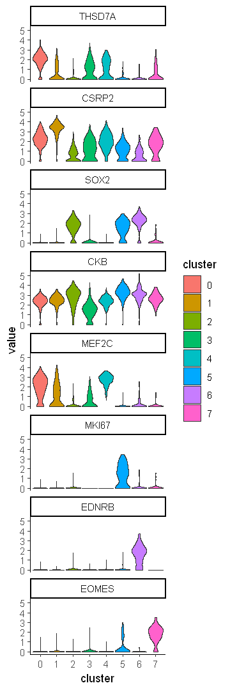

# CNR Bioinformatics Workshop 

[Back to curriculum](README.md)

# 4. Visualization

## 4.1 Load libraries 


```R
library(ggplot2)
library(Seurat)
library(dplyr)
```

## 4.2 Load data


```R
DEX <- read.csv("DEX.csv")
```


```R
head(DEX)
```


<table class="dataframe">
<caption>A data.frame: 6 × 8</caption>
<thead>
	<tr><th></th><th scope=col>X</th><th scope=col>p_val</th><th scope=col>avg_log2FC</th><th scope=col>pct.1</th><th scope=col>pct.2</th><th scope=col>p_val_adj</th><th scope=col>cluster</th><th scope=col>gene</th></tr>
	<tr><th></th><th scope=col>&lt;chr&gt;</th><th scope=col>&lt;dbl&gt;</th><th scope=col>&lt;dbl&gt;</th><th scope=col>&lt;dbl&gt;</th><th scope=col>&lt;dbl&gt;</th><th scope=col>&lt;dbl&gt;</th><th scope=col>&lt;int&gt;</th><th scope=col>&lt;chr&gt;</th></tr>
</thead>
<tbody>
	<tr><th scope=row>1</th><td>THSD7A   </td><td>6.045978e-196</td><td>1.869736</td><td>0.936</td><td>0.344</td><td>9.984329e-192</td><td>0</td><td>THSD7A   </td></tr>
	<tr><th scope=row>2</th><td>CDH7     </td><td>8.096795e-188</td><td>1.887889</td><td>0.677</td><td>0.088</td><td>1.337105e-183</td><td>0</td><td>CDH7     </td></tr>
	<tr><th scope=row>3</th><td>CADM1    </td><td>9.910354e-165</td><td>1.451553</td><td>0.961</td><td>0.594</td><td>1.636596e-160</td><td>0</td><td>CADM1    </td></tr>
	<tr><th scope=row>4</th><td>NTS      </td><td>1.028108e-156</td><td>2.381170</td><td>0.753</td><td>0.192</td><td>1.697817e-152</td><td>0</td><td>NTS      </td></tr>
	<tr><th scope=row>5</th><td>LINC00643</td><td>6.132768e-156</td><td>1.219894</td><td>0.821</td><td>0.219</td><td>1.012765e-151</td><td>0</td><td>LINC00643</td></tr>
	<tr><th scope=row>6</th><td>CNTNAP2  </td><td>1.002729e-146</td><td>1.338118</td><td>0.975</td><td>0.578</td><td>1.655906e-142</td><td>0</td><td>CNTNAP2  </td></tr>
</tbody>
</table>


```R
df0 <- readRDS("df0.rds")
```

## 4.3 Feature plot


```R
genes <- head(DEX)$gene
```

#### Make Feature plots with Seurat function ```FeaturePlot```


```R
options(repr.plot.width = 6, repr.plot.height = 9)
FeaturePlot(df0, features = genes)
```


    

    


#### Use ```NoLegend``` function to remove function


```R
options(repr.plot.width = 6, repr.plot.height = 9)
FeaturePlot(df0, features = genes) + NoLegend()
```


    

    


#### Use ```combine = F``` to create a list of plots that you can modify individually


```R
plist <- FeaturePlot(df0, features = genes, combine = F)
```


```R
typeof(plist)
```


'list'


#### Use ```apply``` to change each object from the list one at a time


```R
plist <- lapply(plist, function(x){
    x = x + NoLegend()
})
```

#### Use ```do.call``` and ```gridExtra``` to present figures


```R
options(repr.plot.width = 6, repr.plot.height = 9)
do.call(gridExtra::grid.arrange, c(plist, ncol = 2))
```


    

    


#### Remove axes and change color scale


```R
plist <- lapply(plist, function(x){
    x = x + scale_color_gradientn(colours = c("grey", RColorBrewer::brewer.pal(9, "YlOrRd"))) +
    theme_void()
    return(x)
})
```

## 4.4 Volcano plot


```R
range(DEX$avg_log2FC)
```


<style>
.list-inline {list-style: none; margin:0; padding: 0}
.list-inline>li {display: inline-block}
.list-inline>li:not(:last-child)::after {content: "\00b7"; padding: 0 .5ex}
</style>
<ol class=list-inline><li>0.250067637009388</li><li>5.11402342406602</li></ol>


```R
options(repr.plot.width = 5, repr.plot.height = 5)
ggplot(DEX, aes(x = avg_log2FC, y = -log10(p_val_adj))) +
    geom_point()
```


    

    


#### Use different ggplot2 themes


```R
options(repr.plot.width = 5, repr.plot.height = 5)
ggplot(DEX, aes(x = avg_log2FC, y = -log10(p_val_adj))) +
    geom_point() +
    theme_classic()
```


    

    


#### Use facet wrap to separate different clusters into individual plots


```R
options(repr.plot.width = 9, repr.plot.height = 9)
ggplot(DEX, aes(x = avg_log2FC, y = -log10(p_val_adj))) +
    geom_point() + 
    facet_wrap(~cluster) +
    theme_classic()
```


    

    


#### Use dplyr to subset data


```R
options(repr.plot.width = 9, repr.plot.height = 9)
ggplot() +
    DEX %>% 
        filter(avg_log2FC > 0) %>%
    geom_point(mapping = aes(x = avg_log2FC, y = -log10(p_val_adj)), data = .) + 
    facet_wrap(~cluster) +
    theme_classic()
```


    

    


#### Use different colors


```R
options(repr.plot.width = 9, repr.plot.height = 9)
ggplot() +
    DEX %>% 
        filter(avg_log2FC > 0) %>%
    geom_point(mapping = aes(x = avg_log2FC, y = -log10(p_val_adj)), data = ., color = "red") +
    DEX %>% 
        filter(avg_log2FC < 0) %>%
    geom_point(mapping = aes(x = avg_log2FC, y = -log10(p_val_adj)), data = ., color = "green") +
    facet_wrap(~cluster) +
    theme_classic()
```


    

    


## 4.5 Violin plots


```R
genes
```


<style>
.list-inline {list-style: none; margin:0; padding: 0}
.list-inline>li {display: inline-block}
.list-inline>li:not(:last-child)::after {content: "\00b7"; padding: 0 .5ex}
</style>
<ol class=list-inline><li>'THSD7A'</li><li>'CDH7'</li><li>'CADM1'</li><li>'NTS'</li><li>'LINC00643'</li><li>'CNTNAP2'</li></ol>


```R
data.to.plot <- as.data.frame(t(as.matrix(df0@assays$RNA@data[genes,])))
```


```R
data.to.plot$cluster <- df0$seurat_clusters
```


```R
head(data.to.plot)
```


<table class="dataframe">
<caption>A data.frame: 6 × 7</caption>
<thead>
	<tr><th></th><th scope=col>THSD7A</th><th scope=col>CDH7</th><th scope=col>CADM1</th><th scope=col>NTS</th><th scope=col>LINC00643</th><th scope=col>CNTNAP2</th><th scope=col>cluster</th></tr>
	<tr><th></th><th scope=col>&lt;dbl&gt;</th><th scope=col>&lt;dbl&gt;</th><th scope=col>&lt;dbl&gt;</th><th scope=col>&lt;dbl&gt;</th><th scope=col>&lt;dbl&gt;</th><th scope=col>&lt;dbl&gt;</th><th scope=col>&lt;fct&gt;</th></tr>
</thead>
<tbody>
	<tr><th scope=row>AAACCCAGTCTCAGGC-1</th><td>2.5219109</td><td>1.125659</td><td>1.416672</td><td>3.4730135</td><td>0.7135008</td><td>2.521911</td><td>0</td></tr>
	<tr><th scope=row>AAACCCAGTGACTATC-1</th><td>1.7966931</td><td>0.000000</td><td>2.490332</td><td>0.6961103</td><td>1.3907357</td><td>1.390736</td><td>4</td></tr>
	<tr><th scope=row>AAACCCATCCCATTTA-1</th><td>0.0000000</td><td>0.000000</td><td>0.000000</td><td>1.2377887</td><td>0.0000000</td><td>1.774268</td><td>4</td></tr>
	<tr><th scope=row>AAACCCATCTGAGAAA-1</th><td>0.6287137</td><td>0.000000</td><td>1.011744</td><td>0.0000000</td><td>0.0000000</td><td>1.011744</td><td>4</td></tr>
	<tr><th scope=row>AAACGAACAATCTGCA-1</th><td>0.0000000</td><td>0.000000</td><td>0.000000</td><td>0.0000000</td><td>0.0000000</td><td>0.000000</td><td>3</td></tr>
	<tr><th scope=row>AAACGCTCAAATGGAT-1</th><td>1.1773758</td><td>0.000000</td><td>1.384908</td><td>4.1090559</td><td>1.8310291</td><td>1.703236</td><td>4</td></tr>
</tbody>
</table>


```R
data.to.plot2 <- reshape2::melt(data.to.plot, id.vars = c("cluster"))
```


```R
head(data.to.plot2)
```


<table class="dataframe">
<caption>A data.frame: 6 × 3</caption>
<thead>
	<tr><th></th><th scope=col>cluster</th><th scope=col>variable</th><th scope=col>value</th></tr>
	<tr><th></th><th scope=col>&lt;fct&gt;</th><th scope=col>&lt;fct&gt;</th><th scope=col>&lt;dbl&gt;</th></tr>
</thead>
<tbody>
	<tr><th scope=row>1</th><td>0</td><td>THSD7A</td><td>2.5219109</td></tr>
	<tr><th scope=row>2</th><td>4</td><td>THSD7A</td><td>1.7966931</td></tr>
	<tr><th scope=row>3</th><td>4</td><td>THSD7A</td><td>0.0000000</td></tr>
	<tr><th scope=row>4</th><td>4</td><td>THSD7A</td><td>0.6287137</td></tr>
	<tr><th scope=row>5</th><td>3</td><td>THSD7A</td><td>0.0000000</td></tr>
	<tr><th scope=row>6</th><td>4</td><td>THSD7A</td><td>1.1773758</td></tr>
</tbody>
</table>


```R
options(repr.plot.width = 9, repr.plot.height = 3)
ggplot(data.to.plot2, aes(x = variable, y = value)) +
    geom_violin()
```


    

    


#### Use ```scale = width```


```R
options(repr.plot.width = 9, repr.plot.height = 3)
ggplot(data.to.plot2, aes(x = cluster, y = value)) +
    geom_violin(scale = "width") +
    theme_classic()
```


    

    


#### Use ```scale = width```


```R
options(repr.plot.width = 9, repr.plot.height = 3)
ggplot(data.to.plot2, aes(x = cluster, y = value)) +
    geom_violin(scale = "width") +
    theme_classic()
```


    

    


#### Use ```fill``` to add color


```R
options(repr.plot.width = 9, repr.plot.height = 3)
ggplot(data.to.plot2, aes(x = cluster, y = value, fill = cluster)) +
    geom_violin(scale = "width") +
    theme_classic()
```


    

    


#### Use facet wrap to show each gene individually


```R
options(repr.plot.width = 9, repr.plot.height = 3)
ggplot(data.to.plot2, aes(x = cluster, y = value, fill = cluster)) +
    geom_violin(scale = "width") +
    facet_wrap(~variable) +
    theme_classic()
```


    

    


#### Pick the most significant DEX gene from each cluster


```R
DEX %>%
    group_by(cluster) %>%
    top_n(-p_val_adj, n = 1)
```


<table class="dataframe">
<caption>A grouped_df: 8 × 8</caption>
<thead>
	<tr><th scope=col>X</th><th scope=col>p_val</th><th scope=col>avg_log2FC</th><th scope=col>pct.1</th><th scope=col>pct.2</th><th scope=col>p_val_adj</th><th scope=col>cluster</th><th scope=col>gene</th></tr>
	<tr><th scope=col>&lt;chr&gt;</th><th scope=col>&lt;dbl&gt;</th><th scope=col>&lt;dbl&gt;</th><th scope=col>&lt;dbl&gt;</th><th scope=col>&lt;dbl&gt;</th><th scope=col>&lt;dbl&gt;</th><th scope=col>&lt;int&gt;</th><th scope=col>&lt;chr&gt;</th></tr>
</thead>
<tbody>
	<tr><td>THSD7A </td><td>6.045978e-196</td><td> 1.869736</td><td>0.936</td><td>0.344</td><td>9.984329e-192</td><td>0</td><td>THSD7A</td></tr>
	<tr><td>CSRP2  </td><td>4.887031e-134</td><td> 2.070127</td><td>0.994</td><td>0.814</td><td>8.070443e-130</td><td>1</td><td>CSRP2 </td></tr>
	<tr><td>SOX2.2 </td><td>1.213735e-136</td><td> 1.551859</td><td>0.892</td><td>0.186</td><td>2.004362e-132</td><td>2</td><td>SOX2  </td></tr>
	<tr><td>CKB.2  </td><td> 9.850717e-67</td><td>-1.437922</td><td>0.861</td><td>0.982</td><td> 1.626747e-62</td><td>3</td><td>CKB   </td></tr>
	<tr><td>MEF2C.3</td><td> 6.308674e-79</td><td> 1.580887</td><td>1.000</td><td>0.508</td><td> 1.041814e-74</td><td>4</td><td>MEF2C </td></tr>
	<tr><td>MKI67  </td><td>1.433349e-265</td><td> 2.652864</td><td>0.690</td><td>0.011</td><td>2.367033e-261</td><td>5</td><td>MKI67 </td></tr>
	<tr><td>EDNRB.1</td><td>2.275104e-292</td><td> 2.798285</td><td>0.839</td><td>0.019</td><td>3.757107e-288</td><td>6</td><td>EDNRB </td></tr>
	<tr><td>EOMES.1</td><td>1.183226e-181</td><td> 2.753743</td><td>0.899</td><td>0.037</td><td>1.953980e-177</td><td>7</td><td>EOMES </td></tr>
</tbody>
</table>


```R
DEX %>%
    group_by(cluster) %>%
    top_n(-p_val_adj, n = 1) %>%
    select(gene)
```

    Adding missing grouping variables: `cluster`
    


<table class="dataframe">
<caption>A grouped_df: 8 × 2</caption>
<thead>
	<tr><th scope=col>cluster</th><th scope=col>gene</th></tr>
	<tr><th scope=col>&lt;int&gt;</th><th scope=col>&lt;chr&gt;</th></tr>
</thead>
<tbody>
	<tr><td>0</td><td>THSD7A</td></tr>
	<tr><td>1</td><td>CSRP2 </td></tr>
	<tr><td>2</td><td>SOX2  </td></tr>
	<tr><td>3</td><td>CKB   </td></tr>
	<tr><td>4</td><td>MEF2C </td></tr>
	<tr><td>5</td><td>MKI67 </td></tr>
	<tr><td>6</td><td>EDNRB </td></tr>
	<tr><td>7</td><td>EOMES </td></tr>
</tbody>
</table>


```R
gene <- DEX %>%
    group_by(cluster) %>%
    top_n(-p_val_adj, n = 1) %>%
    select(gene)
```

    Adding missing grouping variables: `cluster`
    


```R
gene$gene
```


<style>
.list-inline {list-style: none; margin:0; padding: 0}
.list-inline>li {display: inline-block}
.list-inline>li:not(:last-child)::after {content: "\00b7"; padding: 0 .5ex}
</style>
<ol class=list-inline><li>'THSD7A'</li><li>'CSRP2'</li><li>'SOX2'</li><li>'CKB'</li><li>'MEF2C'</li><li>'MKI67'</li><li>'EDNRB'</li><li>'EOMES'</li></ol>


```R
data.to.plot <- as.data.frame(t(as.matrix(df0@assays$RNA@data[gene$gene,])))
```


```R
data.to.plot$cluster <- df0$seurat_clusters
```


```R
data.to.plot2 <- reshape2::melt(data.to.plot, id.vars = c("cluster"))
```


```R
options(repr.plot.width = 3, repr.plot.height = 9)
ggplot(data.to.plot2, aes(x = cluster, y = value, fill = cluster)) +
    geom_violin(scale = "width") +
    facet_wrap(~variable, ncol = 1) +
    theme_classic()
```


    

    


## 4.6 Install and run Cerebro


```R
install.packages("remotes")
```

    package 'remotes' successfully unpacked and MD5 sums checked
    
    The downloaded binary packages are in
    	C:\Users\ZLI2\AppData\Local\Temp\3\Rtmp6hrUI3\downloaded_packages
    


```R
BiocManager::install("romanhaa/cerebroApp")
```

    'getOption("repos")' replaces Bioconductor standard repositories, see
    '?repositories' for details
    
    replacement repositories:
        CRAN: https://cran.r-project.org
    
    
    Bioconductor version 3.14 (BiocManager 1.30.18), R 4.1.3 (2022-03-10)
    
    Installing github package(s) 'romanhaa/cerebroApp'
    
    Downloading GitHub repo romanhaa/cerebroApp@HEAD
    
    

    Rcpp  (1.0.8.3 -> 1.0.9) [CRAN]
    later (1.2.0   -> 1.3.0) [CRAN]
    

    Installing 2 packages: Rcpp, later
    
    

    
      There is a binary version available but the source version is later:
          binary source needs_compilation
    Rcpp 1.0.8.3  1.0.9              TRUE
    
      Binaries will be installed
    package 'Rcpp' successfully unpacked and MD5 sums checked
    

    Warning message:
    "cannot remove prior installation of package 'Rcpp'"
    Warning message in file.copy(savedcopy, lib, recursive = TRUE):
    "problem copying C:\Users\ZLI2\Miniconda3\envs\myEnv\lib\R\library\00LOCK\Rcpp\libs\x64\Rcpp.dll to C:\Users\ZLI2\Miniconda3\envs\myEnv\lib\R\library\Rcpp\libs\x64\Rcpp.dll: Permission denied"
    Warning message:
    "restored 'Rcpp'"
    

    package 'later' successfully unpacked and MD5 sums checked
    

    Warning message:
    "cannot remove prior installation of package 'later'"
    Warning message in file.copy(savedcopy, lib, recursive = TRUE):
    "problem copying C:\Users\ZLI2\Miniconda3\envs\myEnv\lib\R\library\00LOCK\later\libs\x64\later.dll to C:\Users\ZLI2\Miniconda3\envs\myEnv\lib\R\library\later\libs\x64\later.dll: Permission denied"
    Warning message:
    "restored 'later'"
    

    
    The downloaded binary packages are in
    	C:\Users\ZLI2\AppData\Local\Temp\3\Rtmp6hrUI3\downloaded_packages
    

    Running `R CMD build`...
    
    

    * checking for file 'C:\Users\ZLI2\AppData\Local\Temp\3\Rtmp6hrUI3\remotes944065c13363\romanhaa-cerebroApp-0de48b6/DESCRIPTION' ... OK
    * preparing 'cerebroApp':
    * checking DESCRIPTION meta-information ... OK
    * checking for LF line-endings in source and make files and shell scripts
    * checking for empty or unneeded directories
    Omitted 'LazyData' from DESCRIPTION
    * building 'cerebroApp_1.3.1.tar.gz'
    

    Old packages: 'ica', 'later', 'Rcpp'
    
    


```R
cerebroApp::exportFromSeurat(nGene = "nFeature_RNA",
                            nUMI = "nCount_RNA",
                            groups = "seurat_clusters",
                            object = df0,
                            assay = "RNA",
                            file = "df0.crb",
                            experiment_name = "workshop",
                            organism = "Human")
```

    [15:52:47] Start collecting data...
    
    [15:52:47] Overview of Cerebro object:
    
    
    class: Cerebro_v1.3
    cerebroApp version: 1.3.1
    experiment name: workshop
    organism: Human
    date of analysis: 
    date of export: 2022-07-10
    number of cells: 2,125
    number of genes: 16,514
    grouping variables (1): seurat_clusters
    cell cycle variables (0): 
    projections (1): umap
    trees (0): 
    most expressed genes: 
    marker genes:
    enriched pathways:
    trajectories:
    extra material:
    
    
    [15:52:47] Saving Cerebro object to: df0.crb
    
    [15:52:52] Done!
    
    


```R
cerebroApp::launchCerebro()
```

    ##---------------------------------------------------------------------------##
    ## Launching Cerebro v1.3
    ##---------------------------------------------------------------------------##
    
    Loading required package: shiny
    
    
    Listening on http://127.0.0.1:6565
    
    class: Cerebro_v1.3
    cerebroApp version: 1.3.0
    experiment name: pbmc_10k_v3
    organism: hg
    date of analysis: 2020-09-21
    date of export: 2020-09-21
    number of cells: 501
    number of genes: 1,000
    grouping variables (3): sample, seurat_clusters, cell_type_singler_blueprintencode_main
    cell cycle variables (1): Phase
    projections (4): tSNE, tSNE_3D, UMAP, UMAP_3D
    trees (3): sample, seurat_clusters, cell_type_singler_blueprintencode_main
    most expressed genes: sample, seurat_clusters, cell_type_singler_blueprintencode_main
    marker genes:
      - cerebro_seurat (3): sample, seurat_clusters, cell_type_singler_blueprintencode_main
    enriched pathways:
      - cerebro_seurat_enrichr (3): sample, seurat_clusters, cell_type_singler_blueprintencode_main, 
      - cerebro_GSVA (3): sample, seurat_clusters, cell_type_singler_blueprintencode_main
    trajectories:
      - monocle2 (2): all_cells, subset_of_cells
    extra material:
      - tables (1): SingleR_results
    
    
    
    
    class: Cerebro_v1.3
    cerebroApp version: 1.3.1
    experiment name: workshop
    organism: Human
    date of analysis: 
    date of export: 2022-07-10
    number of cells: 2,125
    number of genes: 16,514
    grouping variables (1): seurat_clusters
    cell cycle variables (0): 
    projections (1): umap
    trees (0): 
    most expressed genes: 
    marker genes:
    enriched pathways:
    trajectories:
    extra material:
    
    
    
    
    Warning message:
    "`autoHideNavigation` only works with DT client mode and it will be ignored"
    Warning message:
    "The select input "expression_genes_input" contains a large number of options; consider using server-side selectize for massively improved performance. See the Details section of the ?selectizeInput help topic."
    Warning message:
    "`autoHideNavigation` only works with DT client mode and it will be ignored"
    Warning message:
    "`autoHideNavigation` only works with DT client mode and it will be ignored"
    Warning message:
    "`autoHideNavigation` only works with DT client mode and it will be ignored"
    Warning message:
    "`autoHideNavigation` only works with DT client mode and it will be ignored"
    

